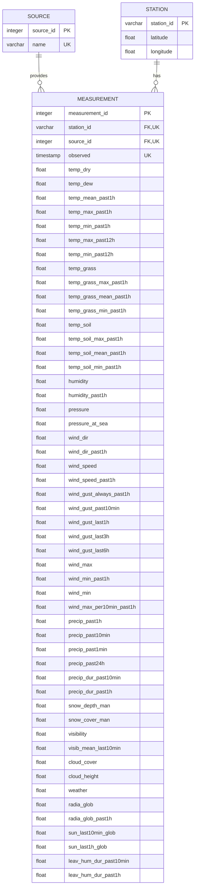

# Opgave 2 - Indsamling af miljødata

## Beskrivelse af projektet
Dette projekt har til formål at indsamle miljødata, som kan bruges til at vurdere kvaliteten af det fysiske arbejdsmiljø. Projektet anvender data fra DMIs offentlige API og gemmer data i en PostgreSQL-database. Data behandles gennem en ETL-pipeline, hvor data først hentes, derefter transformeres og til sidst indsættes i databasen.

## Beskrivelse af, hvordan projektet bygges, testes og køres
Projektet er udviklet i Python og køres ved hjælp af Docker og Docker Compose. Docker sørger for, at applikationen og PostgreSQL-databasen kan køre i separate containere med de nødvendige afhængigheder.

Før projektet bygges og køres, skal der oprettes en `.env`-fil i projektets root-mappe. Filen skal indeholder:
```text
POSTGRES_DB=postgres_db
POSTGRES_USER=admin
POSTGRES_PASSWORD=password
POSTGRES_HOST=db
POSTGRES_PORT=5432
PGADMIN_USER_EMAIL=admin@example.com
PGADMIN_PASSWORD=password
```
`POSTGRES_HOST=db` og `POSTGRES_PORT=5432` skal ikke ændres, da de bruges til forbindelsen mellem Docker-containerne. De øvrige værdier kan vælges af brugeren. Disse værdier skal bruges, når der oprettes forbindelse til databasen og pgAdmin. `.env`-filen indeholder loginoplysninger og skal derfor ikke pushes til GitHub og er inkluderet i `.gitignore`.

Projektet indeholder en pgAdmin-container, som kan bruges til at se og arbejde med PostgreSQL-databasen. pgAdmin startes med kommandoen `docker compose up -d pgadmin`. Derefter åbnes http://localhost:8080/ i en browser. Log ind med email og password fra `.env`-filen (`PGADMIN_USER_EMAIL` og `PGADMIN_PASSWORD`). Når forbindelsen til PostgreSQL åbnes bliver brugeren bedt om et password. Her bruges værdien for `POSTGRES_PASSWORD` fra `.env`-filen. 

### Byg projektet
Projektets Docker-image bygges med kommandoen `docker compose build app`.
Kommandoen bygger applikationens Docker-image ud fra projektets Dockerfile og installerer de nødvendige Python-pakker.

### Test projektet
Projektet testes med enhedstest ved hjælp af pakken `pytest`. Projektets tests køres med kommandoen `docker compose run --rm app pytest`. Testene kontrollerer blandt andet, at data bliver transformeret og indlæst korrekt, samt at de forskellige dele af ETL-processen fungerer. Testenes coverage kan tjekkes med kommandoen `docker compose run --rm app pytest --cov=app --cov=etl`. 

### Kør projektet
Projektet køres ved at PostgreSQL-databasen først startes med kommandoen `docker compose up -d db`. Derefter kan applikationen køres med `docker compose run --rm app python -m app.main`. Når programmet startes, oprettes databasetabeller, og data fra DMIs API hentes for de seneste 10 minutter. Dataene transformeres til projektets format og indsættes i PostgreSQL-databasen. Programmet fortsætter herefter med at hente nye data hvert 10. minut, så længe programmet kører.

## Beskrivelse af den implementerede softwarearkitektur
Projektet er opbygget som en ETL-pipeline, hvor data først hentes fra DMIs offentlige API, derefter transformeres det til projektets datastruktur og til sidst indlæses dataen i en PostgreSQL-database.

`main.py` fungerer som programmets hovedfil og starter databaseopsætningen samt ETL processen.

ETL-processen er delt op i forskellige funktioner og filer med hvert sit ansvar:
- `extract_dmi.py` henter data fra DMI's API.
- `transform.py` omdanner de hentede data til et ensartet format, som kan bruges af databasen.
- `load.py` indsætter de transformerede data i PostgreSQL-databasen.
- `etl_dmi.py` styrer hele ETL-processen.

`database.py` indeholder funktioner til at oprette forbindelse til PostgreSQL og til at oprette eller finde en datakilde i source-tabellen.

Databasens struktur oprettes og versioneres ved hjælp af database migrations. `001_initial_scheme.sql` indeholder den første version af databasestrukturen og opretter tabellerne `source`, `station` og `measurement`. Fremtidige ændringer af databasestrukturen kan oprettes som nye migrationsfiler.

## ER diagram over databasestrukturen


## UML-diagram
